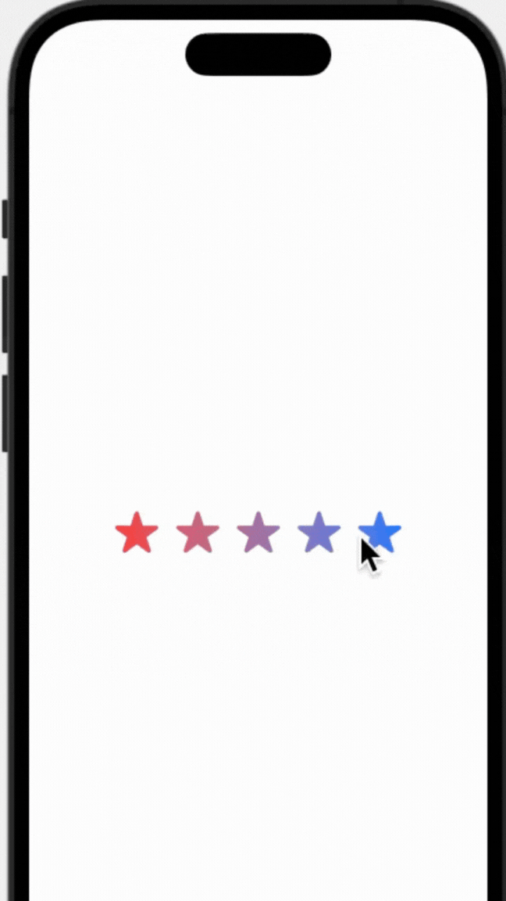
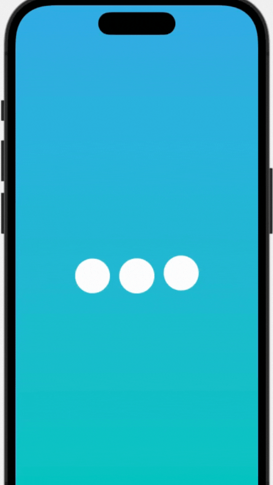

# CoolAnimationsSwiftUI
<h1 style="font-size: 62px;">You can find all the animations in the files here🔎</h2>

  

<h2 align="center" style="font-size: 42px;">
  Created by Geometry Reader
</h2>

  

<h2 align="center" style="font-size: 42px;">
  You can create cool animations to make part of the rectangle transparent, masks make the corresponding parts of the original view invisible.
</h2>

  

<h2 align="center" style="font-size: 42px;">
  You can create cool animations to make part of the circle progress view.
</h2>

